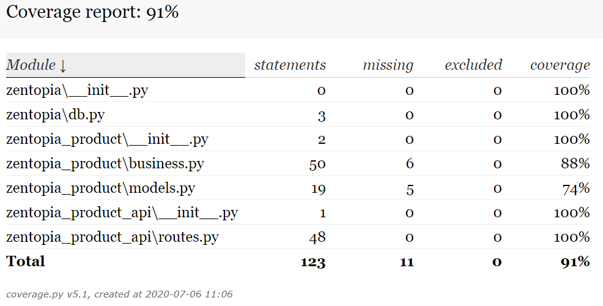

# api-demo

[](https://travis-ci.com/ivangeorgiev/api-demo)

Build APIs with Python, Flask, Flask-Alchemy, Flask-RESTPlus and Pytest


```
/
├─ zentopia/
│  ├─ __init__.py
|  └─ db.py
|
├─ zentopia_api/
│  ├─ __init__.py
|  └─ app.py
|
├─ zentopia_product/
│  ├─ __init__.py
│  ├─ business.py
│  └─ models.py
|
├─ zentopia_product_api/
│  ├─ __init__.py
|  └─ routes.py
|
├─ tests/
|  ├─ __init__.py
|  ├─ conftest.py
|  ├─ test_zentopia_api.py
|  ├─ test_zentopia_product.py
|  └─ test_zentopia_product_api.py
|
├─ logging.conf
├─ README.md
├─ requirements.txt
├─ settings.py
├─ setup.py
├─ wsgi.py
└─ ...
```


## Create Virtual Environment

```bash
$ py -3.7 -m venv .venv
$ source .venv/Scripts/activate
```


## Testing

For application tests, `pytest` is used. To execute application tests:

```bash
$ pytest -v --cov=zentopia --cov=zentopia_product --cov=zentopia_product_api --cov-report html:htmlcov --cov-report xml:coverage.xml --cov-report term
```

This will produce following console output. 

```
(.venv) C:\Sandbox\Learn\Python\restplus\basic-api>
                                                   pytest -v --cov=zentopia --cov=zentopia_product --cov=zentopia_product_api
============================= test session starts ==============================
platform win32 -- Python 3.7.6rc1, pytest-5.4.3, py-1.9.0, pluggy-0.13.1 -- c:\sandbox\learn\python\restplus\basic-api\.venv\scripts\python.exe
cachedir: .pytest_cache
rootdir: C:\Sandbox\Learn\Python\restplus\basic-api
plugins: cov-2.10.0, flask-1.0.0
collected 23 items

tests/test_zentopia_api.py::test_flask_endpoint PASSED                    [  4%]
tests/test_zentopia_api.py::test_db PASSED                                [  8%]
...........
tests/test_zentopia_product_api.py::test_delete_exisitng_product PASSED   [ 95%] 
tests/test_zentopia_product_api.py::test_delete_missing_product PASSED    [100%] 

--------- coverage: platform win32, python 3.7.6-candidate-1 ---------
Name                               Stmts   Miss  Cover
------------------------------------------------------
zentopia\__init__.py                   0      0   100%
zentopia\db.py                         3      0   100%
zentopia_product\__init__.py           2      0   100%
zentopia_product\business.py          50      6    88%
zentopia_product\models.py            19      5    74%
zentopia_product_api\__init__.py       1      0   100%
zentopia_product_api\routes.py        48      0   100%
------------------------------------------------------
TOTAL                                123     11    91%
Coverage HTML written to dir htmlcov
Coverage XML written to file coverage.xml

============================== 23 passed in 0.80s ============================== 
```

In addition it will generate HTML and XML coverage reports. You can open the `htmlcov/index.html` file in a browser to observe the coverage details.



