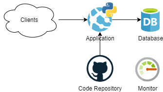
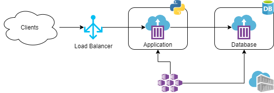
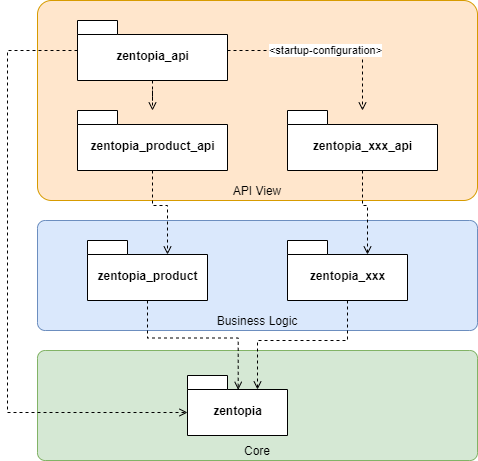

# api-demo

[](https://travis-ci.com/ivangeorgiev/api-demo)
[](https://codecov.io/gh/ivangeorgiev/api-demo)

Sample microservice API with Python, Flask, Flask-Alchemy, Flask-RESTPlus and Pytest

* Source code: https://github.com/ivangeorgiev/api-demo
* Live Demo: https://msapidemo.azurewebsites.net/

# Architecture Overview

Solution uses two tiers:

* Application tier - implemented using Python
* Persistence tier - implemented using relational database
  * SQLite file-based for development
  * SQLite in-memory for testing
  * MySQL or Posgresql for production 

Multiple infrastructure topologies are supported. For example we can deploy the application, using cloud platform-as-a-service-based solution or docker-based solution.

## Platform-as-a-Service (PaaS) Based Solution

This solution uses PaaS from the cloud provider, e.g. Azure. With this approach we focus on the implementation of the application logic. The infrastructure management is taken care of from the cloud provider.



Here are some of the features, out-of-the-box

* Auto scaling
* Monitoring
* Alerting
* Diagnostics
* Security
* Authentication
* CD integration with GitHub, Bitbucket, etc.

## Docker Based Solution

To provide more infrastructure vendor independent solution, we could use docker containers.



To create complete solution this approach would require much more work on the infrastructure.

# Application Design

## Packages

Solution uses layered style with three layers:

* Core layer - provides database persistence, etc. core functionalities
* Business Logic layer - contains decoupled packages for maintaining business objects.
* API View layer - contains 
  * Basic API package defines the REST API application. Activates and runs microservices, based on application configuration.
  * Decoupled microservice packages. Each package defines API endpoints and resources. 



Chosen approach allows for:

* Scaling business logic (horizontal extensibility) - business packages can be added and maintained without any impact to the existing code base
* Microservice scaling (horizontal extensibility) - each API package represents a microservices. 
  * Microservices can be added and maintained independently.
  * Microservices can use and expose logic from different business packages.
* Deployment flexibility - each API instance can be configured to execute multiple microservices. 
* Vertical extensibility by adding other layers, e.g. SOAP View layer.

## Python Frameworks

Application is implemented using Python.

### Flask

Flask is a lightweight web application framework. It enables agile, quick and easy development and can scale up to complex applications. Free, open source, active community, provides a lot of plugins and extensions. 

Compared to Django is more lightweight and suited better for REST API. 

### Flask-RESTPlus

Adds some RESTful capabilities to Flask:

* Defines namespaces which are ways of creating prefixes and structuring the code. This helps long-term maintenance and helps with the design when creating new endpoints. 
* It has a full solution for parsing input parameters.
* It has a serialization framework for the resulting objects - response marshalling.
* It has Swagger API documentation support, automatically generates Swagger specification, self-documenting page and Swagger UI.

### Flask-Alchemy

Python flask plugin, wrapper around the popular Python's SQLAlchemy ORM.

### Pytest

Python testing framework. Plugin for Flask application integration. 

Compared to other frameworks, e.g. unittest and nose - more flexibility, reusability. Considered more pythonic. Can generate coverage reports in HTML and XML formats.

## Directory Structure

```
/
├─ zentopia/
│  ├─ __init__.py
|  └─ db.py
|
├─ zentopia_api/
│  ├─ __init__.py
|  └─ app.py
|
├─ zentopia_product/
│  ├─ __init__.py
│  ├─ business.py
│  └─ models.py
|
├─ zentopia_product_api/
│  ├─ __init__.py
|  └─ routes.py
|
├─ tests/
|  ├─ __init__.py
|  ├─ conftest.py
|  ├─ test_zentopia_api.py
|  ├─ test_zentopia_product.py
|  └─ test_zentopia_product_api.py
|
├─ .gitignore
├─ .travis.yml
├─ logging.conf
├─ README.md
├─ requirements.txt
├─ settings.py
├─ setup.py
├─ wsgi.py
└─ ...
```


## Continuous Integration

Travis is used for CI. Travis executes `pytest` test cases and generates coverage report which is uploaded to Codecov.io.


# How To

## Create Virtual Environment

```bash
$ py -3.7 -m venv .venv
$ source .venv/Scripts/activate
```


## Testing

For application tests, `pytest` is used. To execute application tests:

```bash
$ pytest -v --cov=zentopia --cov=zentopia_product --cov=zentopia_product_api --cov-report html:htmlcov --cov-report xml:coverage.xml --cov-report term
```

This will produce following console output. 

```
(.venv) C:\Sandbox\Learn\Python\restplus\basic-api>
                                                   pytest -v --cov=zentopia --cov=zentopia_product --cov=zentopia_product_api
============================= test session starts ==============================
platform win32 -- Python 3.7.6rc1, pytest-5.4.3, py-1.9.0, pluggy-0.13.1 -- c:\sandbox\learn\python\restplus\basic-api\.venv\scripts\python.exe
cachedir: .pytest_cache
rootdir: C:\Sandbox\Learn\Python\restplus\basic-api
plugins: cov-2.10.0, flask-1.0.0
collected 23 items

tests/test_zentopia_api.py::test_flask_endpoint PASSED                    [  4%]
tests/test_zentopia_api.py::test_db PASSED                                [  8%]
...........
tests/test_zentopia_product_api.py::test_delete_exisitng_product PASSED   [ 95%] 
tests/test_zentopia_product_api.py::test_delete_missing_product PASSED    [100%] 

--------- coverage: platform win32, python 3.7.6-candidate-1 ---------
Name                               Stmts   Miss  Cover
------------------------------------------------------
zentopia\__init__.py                   0      0   100%
zentopia\db.py                         3      0   100%
zentopia_product\__init__.py           2      0   100%
zentopia_product\business.py          50      6    88%
zentopia_product\models.py            19      5    74%
zentopia_product_api\__init__.py       1      0   100%
zentopia_product_api\routes.py        48      0   100%
------------------------------------------------------
TOTAL                                123     11    91%
Coverage HTML written to dir htmlcov
Coverage XML written to file coverage.xml

============================== 23 passed in 0.80s ============================== 
```

In addition it will generate HTML and XML coverage reports. You can open the `htmlcov/index.html` file in a browser to observe the coverage details.


